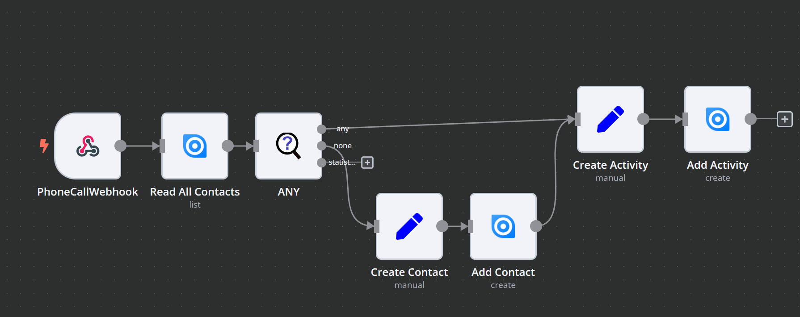

# Any 

The Any-Node can be used to check if there is any match within all entries. Other than the filter node or filter advanced node, the None-Exit is only filled, if there is no match at all. 

In case of any match you can decide if you want to receive all entries, just those that match the filter or just the first that matches the filter.

## Parameters

The Parameters of the Any-Filter are equal to those of the n8n Filter Node. See [the n8n official documentation](https://docs.n8n.io/integrations/builtin/core-nodes/n8n-nodes-base.filter/).

## Input

Input is a list of data that shall be filtered

## Output

The output includes 3 branches

### Any

The any branch is only filled, if the filter found any match. It can then either be filled with the matches or simply all data

### None

The none branch is only filled, if the filter did not match any item. In that case, the NoneBranch receives the whole list from the input.

### Statistic

The statistic branch can be used to read some meta data of the operation. It includes only 1 element with the following parameters:

* **any**: True if any match was found,
* **none**: Only true if no match was found,
* **kept**: The number of entries that matched the filter
* **dropped**: The number of dropped entries

## Example

This node receives the number of a performed phone call. It reads the contacts list from  Ninox and adds an Activity.

**What was the challenge?**
If the contact does not yet exist, it needs to be created; additionally it might be required to create a Ticket to fill the contact. So we needed to find out, if **any** item in the contact list matches the phone number

