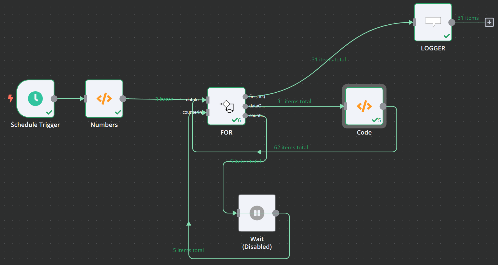

# For 


The For-Loop-Node runs a certain workflow multiple times. 

During the loop, it outputs the incoming data _dataIn_ to _dataOut_ and additionally a counter Object.

## Parameters

The FOR-Node provides several parameters:

### Start Value

The first value that shall be output

### Step Value

The value by which the counter shall be increased (or decreased!) on every run

### End Value

The value that needs to be met or crossed to stop the ForLoop

### Override Counter

If this switch is activated, the values for Step, CurrentValue and EndValue are read from the CounterIn Input. By this you gain all flexibility to adjust the ForLoop on the run

### Safety Switch

The safety switch shall avoid neverending loops **Always always ALWAYS** start your development with this switch being activated. Only deactivate it, if you're really sure you need it. This switch saves you from restarting your whole instance!

## Input

### Data

A list of data that might be used in the ForLoop

### Counter

The Counter input that shall be upated

## Output

The output includes 3 branches

### Finished

This output receives the data from the Data Input once the loop has finished

### Data

This output receives the data from the Data Input while the loop is not finished

### Counter

This output provides the current index

````
{
	counter: The current LoopValue,
	start: The start value of the loop,
	step: The step value of the loop,
	end: The end value of the loop,
	runIndex: How often was the For Loop already called?,
}
```` 
Once the counter meets or crosses the end-Value (**Remark**: As step could be negative, end could be below start! ), the _dataIn_ data is output to _finish_.

> **IMPORTANT**
>
> The CounterOut and the CounterIn need to be connected. You may include other nodes inbetween; e.g. a "Wait", but it's important that the CounterIn matches the CounterOut format! 
>
>**Otherwise your operation might lead to an endless loop**


> **IMPORTANT**
>
> At least during development you should a "Wait" node inbetween CounterOut and CounterIn. You can set it to 1 second, but it's important to check first if your loop works in general.  
>
>**Otherwise your operation might lead to an endless loop that crashes your environment!!!**


## Example

The following example shows how the Node is integrated




The numbers-Node creates 3 input items. The "Code" Node duplicates the list. 
