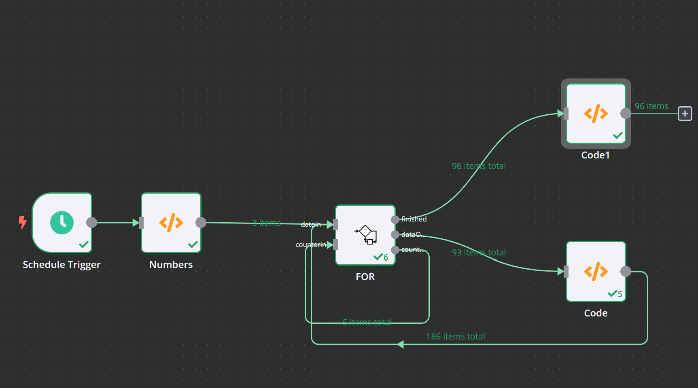

# For 


The For-Loop-Node runs a certain workflow multiple times. 

During the loop, it outputs the incoming data _dataIn_ to _dataOut_ and additionally a counter Object of the following structure:

````
{
	counter: The current LoopValue,
	start: The start value of the loop,
	step: The step value of the loop,
	end: The end value of the loop,
	runIndex: How often was the For Loop already called?,
}
```` 
Once the counter meets or crosses the end-Value (**Remark**: As step could be negative, end could be below start! ), the _dataIn_ data is output to _finish_.

## Example

The following example shows how the Node is integrated


