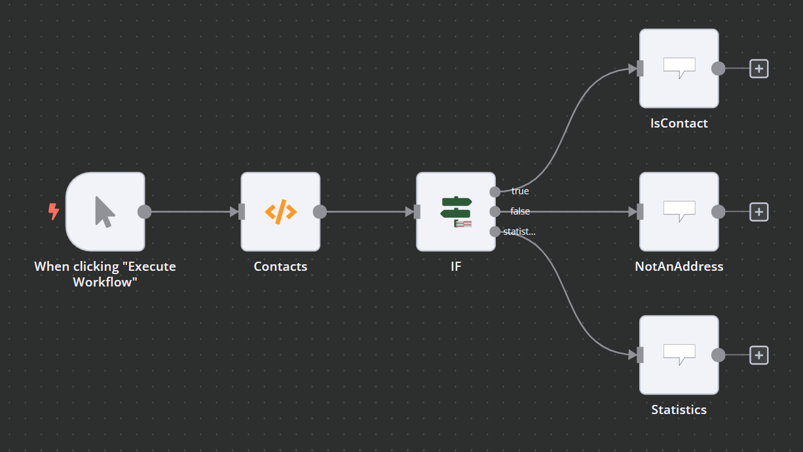

# If Advanced

The If Advanced node equals the If Node of the default n8n package (as of version 1.20.0), but it provides an additional node exit to read statistics.

## Parameters

The parameters of the IfAdvanced Node equal the parameters of the normal If-Node. For details, see [the official n8n documentation](https://docs.n8n.io/integrations/builtin/core-nodes/n8n-nodes-base.if/)

## Inputs

The input receives all Data to be checked

## Outputs 

### True

Returns a list of all items where the result is true

### False

Returns a list of all items where the result is false

### Statistics

Returns a single item of the following Structure:

* **allTrue**: True if all are true
* **allFalse**: True if all are false
* **trueCount**: Amount of True items
* **falseCount**: Amount of False items

## Example

In this example we test Which entries are contacts.
