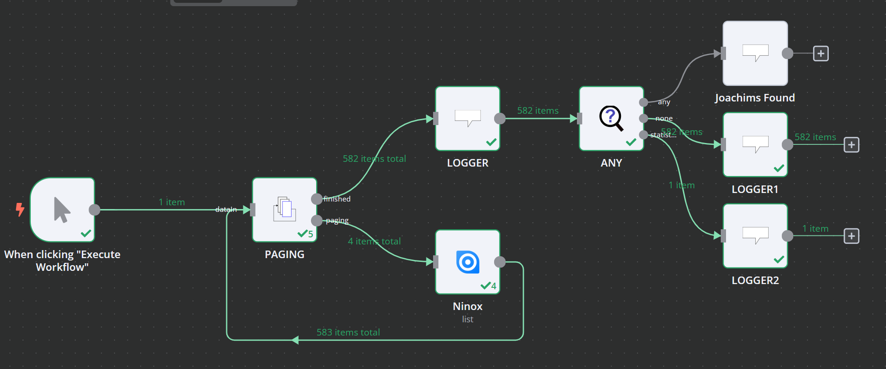

# Paging

The paging node is specifically used for the purpose of calling workflows multiple times until they don't return any further data. A common use case for this is Paging of HTTP Requests

## Parameters

### StartValue

The StartValue is the very first value to be provided in the CounterOutput

### StepValue

How much shall the counter value grow per execution

### MaxAmount

The MaxAmount Attribute can be used to describe the desired maximum amount of data per run

> **NOTE**: This value is just provided via the Counter-Output. It has no influence whatsoever if you don't use it as parameter in workflow itself!

### Result

The type of result you would like to receive:

#### All Collected

This creates a flat map chain of items, listing all items from all results during pagination.

#### Last

This only provides the last items returned before no items were returned.

#### Longest

This only provides the pagination result with the most entries in one go.

#### Shortest

This only provides the pagination result with the least entries in one go. (Ignoring the empty result).

## Input

The Paging node has one input that receives new Data

## Outputs

The Paging node has 2 Outputs

### Paging

The Paging provides the index and some meta data that can be used to trigger the next workflow. E.g. you can use the index as a page in an HTTP Request that supports pagination.

This output provides a single item with the following parameters

* **runIndex**: How often was the subWorkflow run?
* **index**: The current Paging index, starting from the StartValue
* **maxAmount**: The maximum amount of desired data
* **Count**: The current count of items that wait to be returned via the Finished-Branch
* **Step**: The StepSize

### Finished

The Finished-Branch receives the result data when the paging is finished.

This output can be one of the following:

* **All**: All Data is combined to a long list
* **Last**: The last List that included data is returned
* **Shortest**: The result is the shortest list ever received (putting aside an empty result)
* **Longest**: The result is the longest list ever received

## Important Notice

To ensure that the Paging Node can work, you have to activate the Option "Always Output Data" within the sub-workflow of the paging-output

## Example

An example might be an API node that supports pagination but only as a single input parameter "Which page would you like to read?"

> **NOTE**: The normal HTTP Node itself supports Pagination. Using our pagination loop gives you a bit more flexibility in the behavior, but you might not need this at all. So, if you want to use this node with the HTTP Node, check first if the HTTP Nodes pagination does already satisfy your needs.

