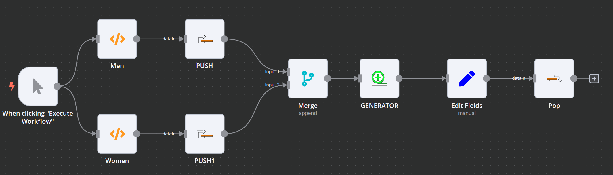

# Shelf
 + 

The Shelf is a way to store data ("Put it on the shelf") via Push and receive it back via Pop.

## Push

Push is used to put data "on the shelf"

### Parameters

#### Name

The name under which data shall be pushed to the shelf

### Input

The data to be put on the shelf

### Output

The output equals the input

---

## Pop

Pop is used to get data "from the shelf"

### Parameters

#### Name

The name under which data is stored on the shelf

### Input

Irrelevant

### Output

The data from the shelf or an empty array if nothing is found.

---

## Example

The nodes can be used in any workflow where data might be required multiple times. In some cases this can also be achieved through Merge-Nodes, but Push and Pop seem a bit more readable.

