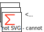

# SizeCheck

The SizeCheck Node checks if the size of the input list is less, equal or more than a given number

## Example

In this example, some data is generated in the Code Node. Depending on the Result for the SizeCheck, different Logs are triggered

## Input

Any List

## Output

The input List to the correct output, depending on the comparison result

## Example Scenarios

The Node is mostly used to monitor size limits. Imagine some input that grows over time, so with every new call of the work flow, a bit more data is handled. You might not even know if the flow might ever exceed the critical amount of entries that you can write into a table. 

So, you can either put work into such edge case right from the beginning or you put it "on the shelf" for later. Now you could e.g. trigger the activation of a ticket in your ticketsystem to tackle this topic. 
